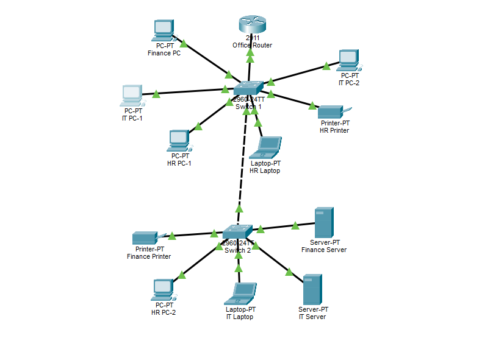
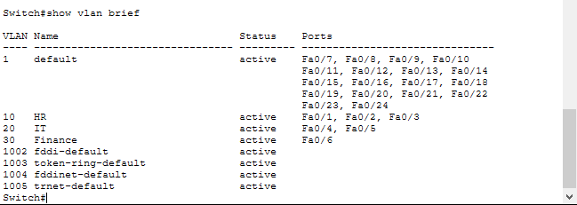
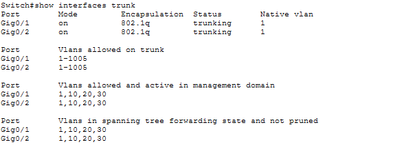
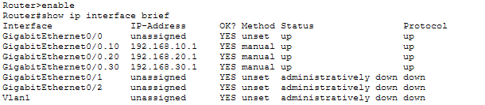
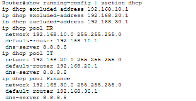
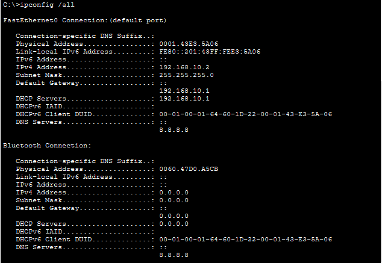
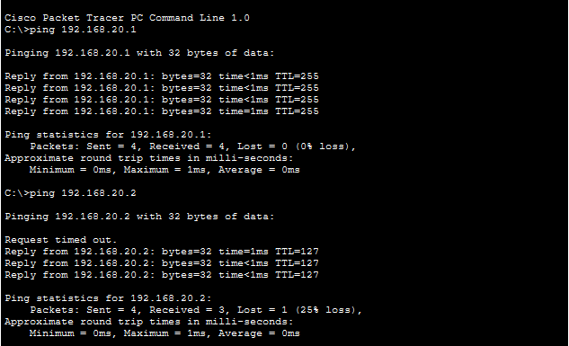

# VLAN Network Project

## Project Overview 📌

This project demonstrates the design and configuration of a segmented network using Cisco Packet Tracer.

The network separates three departments — HR, IT and Finance — into different VLANs while still allowing communication between them through inter-VLAN routing.

---

## Project Objective 🎯

The main objective of this project was to build a functional segmented network and understand how VLANs, trunking, Router-on-a-Stick, DHCP, and inter-VLAN routing work together.

Through this project, I aimed to:

- Create separate VLANs for different departments.
- Assign end devices to their appropriate VLANs.
- Configure trunk links to carry multiple VLANs.
- Configure Router-on-a-Stick for inter-VLAN routing.
- Configure DHCP for automatic IP address assignment.
- Configure default gateways for each VLAN.
- Test connectivity within and between VLANs.
- Verify that the complete network operates successfully.

---

## Network Components 🏗️

The network consists of:

- 1 × Cisco 2911 Router
- 2 × Cisco 2960 Switches
- HR Department
- IT Department
- Finance Department
- Multiple end devices

---

## VLAN Configuration 🔹

Three VLANs were created to logically separate the departments:

| Department | VLAN | Purpose |
|------------|------|---------|
| HR | VLAN 10 | HR department devices |
| IT | VLAN 20 | IT department devices |
| Finance | VLAN 30 | Finance department devices |

VLANs provide logical separation between departments even when devices share the same physical switching infrastructure.

The VLAN configuration was verified using the `show vlan brief` command.

---

## Trunking 🔗 

Trunk links were configured to carry traffic belonging to multiple VLANs between network devices.

The following links were configured as trunks:

- Switch 1 ↔ Switch 2
- Switch 1 ↔ Router

This allows VLAN 10, VLAN 20, and VLAN 30 traffic to travel across the required links.

The trunk configuration was verified using the `show interfaces trunk` command.

---

## Inter-VLAN Routing 🌐 

Router-on-a-Stick was implemented to allow communication between the different VLANs.

Three router subinterfaces were configured:

- `G0/0/0.10` → VLAN 10
- `G0/0/0.20` → VLAN 20
- `G0/0/0.30` → VLAN 30

Each subinterface acts as the default gateway for its respective VLAN.

The router's subinterfaces were verified using the `show ip interface brief` command.

---

## DHCP Configuration 📡 
 
DHCP was configured on the router to automatically provide network configuration to end devices.

DHCP provides devices with:

- IP address
- Subnet mask
- Default gateway
- DNS server information

The DHCP configuration was verified on the router.

### DHCP Assignment Verification

The `ipconfig /all` command was used on an end device to verify that its network information was automatically assigned through DHCP.

---

## Default Gateways 🧭 

Each VLAN was configured with its own default gateway:

- VLAN 10 → `192.168.10.1`
- VLAN 20 → `192.168.20.1`
- VLAN 30 → `192.168.30.1`

The default gateway allows devices to communicate with networks outside their own VLAN.

---

## Connectivity Testing 🧪 

After completing the configuration, connectivity was tested using the `ping` command.

The tests verified:

- Connectivity between a device and its default gateway.
- Connectivity between devices belonging to different VLANs.
- Successful inter-VLAN routing through the router.

The successful ping results confirmed that the VLANs, trunk links, router subinterfaces, default gateways, DHCP configuration and inter-VLAN routing were working together correctly.

---

## Technologies and Concepts Used 🛠️ 

- Cisco Packet Tracer
- Cisco 2911 Router
- Cisco 2960 Switches
- VLANs
- Access Ports
- IEEE 802.1Q Trunking
- Router-on-a-Stick
- Router Subinterfaces
- DHCP
- IPv4
- Default Gateways
- Inter-VLAN Routing
- ICMP Ping

---

## Learning Outcomes 📚 

Through this project, I practiced:

- Creating and configuring VLANs.
- Assigning switch ports to VLANs.
- Configuring access ports.
- Configuring trunk ports.
- Connecting multiple switches.
- Configuring router subinterfaces.
- Implementing Router-on-a-Stick.
- Configuring DHCP.
- Understanding default gateways.
- Verifying IP configuration.
- Testing same-network and inter-VLAN connectivity.
- Troubleshooting basic network connectivity.

---
## Complete Project 🏆 

**Project Status: COMPLETE**

This project brings together all the networking concepts configured throughout the project:

- 2 × Cisco 2960 Switches
- 1 × Cisco 2911 Router
- HR, IT, and Finance VLANs
- Correct access-port assignments
- S1 ↔ S2 trunk
- S1 ↔ Router trunk
- Router-on-a-Stick
- Three router subinterfaces
- DHCP for all VLANs
- Correct default gateways
- Automatic IP address assignment
- Same-network connectivity
- Inter-VLAN routing
- Successful connectivity testing
- Saved router configuration

The successful connectivity tests demonstrate that these components are not working independently — they are working together as one functional, segmented network.
